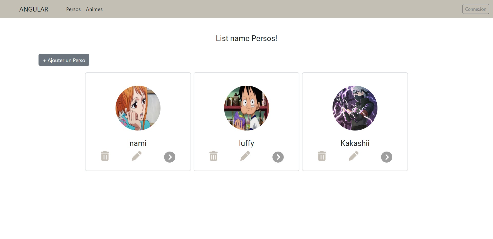

# Description du projet :

Ce projet est un front-end développé en Angular qui communique avec une API REST Node.js pour effectuer les opérations CRUD (create, read, update, delete) sur une base de données.

Il inclut également un système de connexion pour permettre aux utilisateurs de s'authentifier avant d'accéder aux données. Cette fonctionnalité est mise en œuvre en utilisant canActivate pour protéger les routes qui nécessitent une authentification.

This project was generated with [Angular CLI](https://github.com/angular/angular-cli) version 14.2.1.

## Development server

Run `ng serve` for a dev server. Navigate to `http://localhost:4200/`. The application will automatically reload if you change any of the source files.

